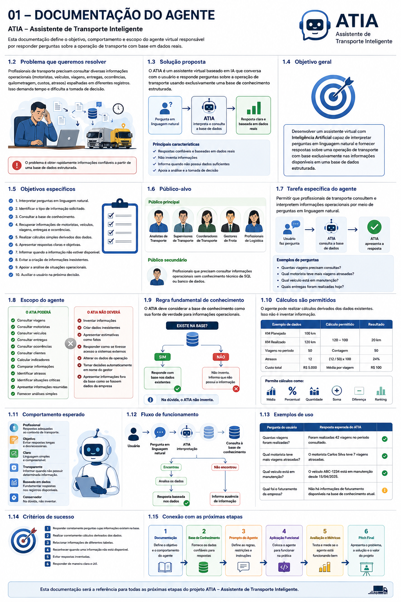

# Etapa 1 — Documentação do Agente



## 1. Nome do Projeto

**Assistente de Transporte IA**

### Nome do Agente

**ATIA — Assistente de Transporte Inteligente**

---

## 2. Problema

Na operação de transporte existe uma grande quantidade de informações relacionadas a motoristas, veículos, viagens, entregas, clientes, ocorrências, quilometragem e custos.

Profissionais responsáveis pela operação precisam consultar essas informações para acompanhar o desempenho e tomar decisões. Quando os dados estão distribuídos em diferentes registros, a obtenção de informações pode ser demorada.

O ATIA foi proposto para facilitar a consulta e a interpretação dessas informações por meio de perguntas em linguagem natural.

---

## 3. Solução Proposta

O ATIA será um assistente virtual com Inteligência Artificial capaz de conversar com o usuário e responder perguntas relacionadas à operação de transporte.

O agente utilizará uma base de conhecimento estruturada contendo informações sobre:

- motoristas;
- veículos;
- viagens;
- entregas;
- clientes;
- ocorrências.

O principal princípio do projeto será a confiabilidade das respostas: o agente deverá utilizar os dados disponíveis na base de conhecimento e não deverá inventar informações.

Quando a informação solicitada não estiver disponível, o agente deverá informar claramente que não possui dados suficientes para responder.

---

## 4. Objetivo Geral

Desenvolver um assistente virtual com Inteligência Artificial capaz de interpretar perguntas em linguagem natural e fornecer respostas sobre uma operação de transporte com base exclusivamente nas informações disponíveis em uma base de dados estruturada.

---

## 5. Objetivos Específicos

O ATIA deverá:

1. Interpretar perguntas realizadas em linguagem natural.
2. Identificar o tipo de informação solicitado.
3. Consultar a base de conhecimento.
4. Recuperar informações relacionadas a motoristas, veículos, viagens, entregas e ocorrências.
5. Realizar cálculos simples derivados dos dados existentes.
6. Apresentar respostas de maneira clara e objetiva.
7. Informar quando uma informação não estiver disponível.
8. Evitar a criação de informações que não estejam presentes na base.
9. Apoiar a análise de situações operacionais.
10. Auxiliar o usuário na identificação de possíveis pontos de atenção.

---

## 6. Público-Alvo

O público principal do ATIA é formado por profissionais envolvidos na gestão e operação de transporte:

- Analistas de Transporte;
- Supervisores de Transporte;
- Coordenadores de Transporte;
- Gestores de Frota;
- Profissionais de Logística.

O assistente também poderá apoiar profissionais que precisem consultar informações operacionais sem conhecimento técnico de SQL ou banco de dados.

---

## 7. Tarefa Específica do Agente

A tarefa principal do ATIA será:

> Permitir que profissionais de transporte consultem e interpretem informações operacionais por meio de perguntas em linguagem natural.

O foco do agente não será responder qualquer pergunta sobre transporte, mas facilitar o acesso às informações existentes na base de conhecimento do projeto.

---

## 8. Escopo

### 8.1 O ATIA poderá

- consultar viagens;
- consultar motoristas;
- consultar veículos;
- consultar entregas;
- consultar ocorrências;
- consultar clientes;
- calcular indicadores derivados dos dados;
- comparar informações;
- identificar registros atrasados;
- identificar situações registradas como críticas;
- apresentar informações resumidas;
- realizar análises simples fundamentadas nos dados.

### 8.2 O ATIA não deverá

- inventar informações;
- criar dados inexistentes;
- apresentar estimativas como fatos;
- afirmar que possui acesso a sistemas externos;
- alterar os dados da operação;
- tomar decisões automaticamente em nome do gestor;
- apresentar informações fora da base como se fossem dados da empresa.

---

## 9. Regra Fundamental de Conhecimento

A base de conhecimento será considerada a fonte de verdade para as informações operacionais do agente.

> **O ATIA deve responder com base nos dados disponíveis na base de conhecimento e não deve inventar informações ausentes.**

### Fluxo de decisão

```text
Pergunta do usuário
        |
        v
Interpretação da pergunta
        |
        v
Consulta à base
        |
   +----+----+
   |         |
   v         v
Encontrou   Não encontrou
   |         |
   v         v
Analisa    Não inventa
   |         |
   +----+----+
        |
        v
Resposta
```

Essa regra será posteriormente implementada tecnicamente na aplicação. O prompt sozinho não será considerado suficiente para garantir a ausência de alucinações.

---

## 10. Cálculos Derivados

O agente poderá realizar cálculos quando todos os dados necessários estiverem disponíveis na base.

Exemplos:

- diferença entre KM planejado e KM realizado;
- quantidade de viagens;
- quantidade de entregas;
- percentual de atrasos;
- médias;
- somas;
- rankings;
- comparações.

Os resultados calculados deverão ser derivados exclusivamente dos dados existentes.

### Exemplo

```text
KM planejado = 100
KM realizado = 120

Diferença = 120 - 100
Diferença = 20 km
```

O cálculo é permitido porque utiliza dados existentes na base.

---

## 11. Comportamento Esperado

O ATIA deverá ser:

### Profissional
Utilizar linguagem adequada ao contexto de transporte.

### Claro
Apresentar respostas compreensíveis.

### Objetivo
Evitar respostas desnecessariamente longas.

### Transparente
Informar quando não houver dados suficientes.

### Baseado em dados
Fundamentar as respostas nos registros disponíveis.

### Conservador
Quando não houver informação suficiente, não deverá criar ou completar informações por conta própria.

---

## 12. Fluxo de Funcionamento

```text
USUÁRIO
   |
   v
Pergunta em linguagem natural
   |
   v
ATIA — interpretação
   |
   v
Consulta à base de conhecimento
   |
   +-------------------+
   |                   |
   v                   v
Encontrou           Não encontrou
   |                   |
   v                   v
Analisa os dados    Informa ausência
   |                   |
   +---------+---------+
             |
             v
Resposta
```

---

## 13. Exemplos de Uso

### Exemplo 1 — Consulta

**Usuário:**  
"Quantas viagens foram realizadas?"

**Comportamento esperado:**  
O agente consulta os registros de viagens e apresenta a quantidade encontrada.

### Exemplo 2 — Análise

**Usuário:**  
"Qual motorista teve mais viagens atrasadas?"

**Comportamento esperado:**  
O agente relaciona os dados de motoristas e viagens e calcula o resultado a partir dos registros disponíveis.

### Exemplo 3 — Veículos

**Usuário:**  
"Qual veículo está em manutenção?"

**Comportamento esperado:**  
O agente consulta os veículos cujo status registrado seja `Manutenção`.

### Exemplo 4 — Informação inexistente

**Usuário:**  
"Qual foi o faturamento da empresa?"

**Comportamento esperado:**  
Caso não existam informações de faturamento na base, o agente deverá informar que essa informação não está disponível na base de conhecimento atual.

---

## 14. Critérios de Sucesso

O projeto será considerado funcional quando o ATIA conseguir:

1. Responder corretamente perguntas cujas informações existam na base.
2. Realizar corretamente cálculos derivados dos dados.
3. Relacionar informações de diferentes tabelas quando necessário.
4. Reconhecer quando uma informação não estiver disponível.
5. Evitar respostas inventadas.
6. Responder de maneira clara e útil.

Esses critérios serão utilizados posteriormente na Etapa 5 — Avaliação e Métricas.

---

## 15. Conexão com as Próximas Etapas

```text
1. Documentação
       |
       v
2. Base de Conhecimento
       |
       v
3. Prompts
       |
       v
4. Aplicação Funcional
       |
       v
5. Avaliação e Métricas
       |
       v
6. Pitch
```

A documentação desta etapa será a referência para as próximas fases. A Base de Conhecimento será validada de acordo com o objetivo e o escopo definidos aqui. Os Prompts serão construídos com base nas regras estabelecidas. A Aplicação utilizará a base e os prompts. A Avaliação verificará se o comportamento esperado foi alcançado. Por fim, o Pitch apresentará o problema, a solução e os resultados do projeto.

---

## 16. Observação sobre os Dados

Os dados utilizados no protótipo serão dados fictícios criados exclusivamente para fins educacionais, de demonstração, desenvolvimento e testes.

Eles não representam dados reais de uma empresa de transporte.
